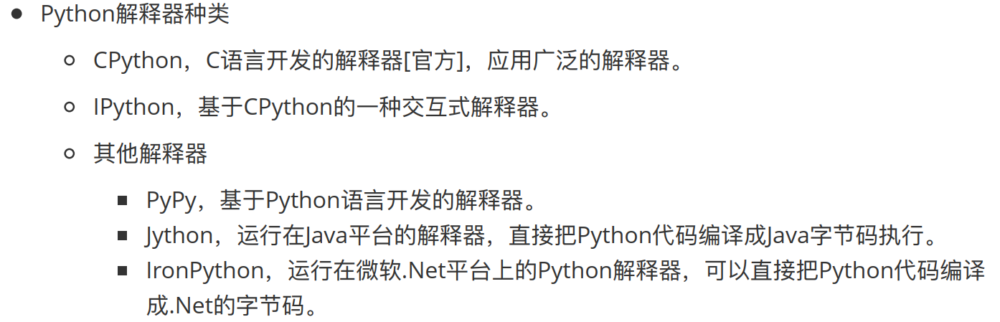
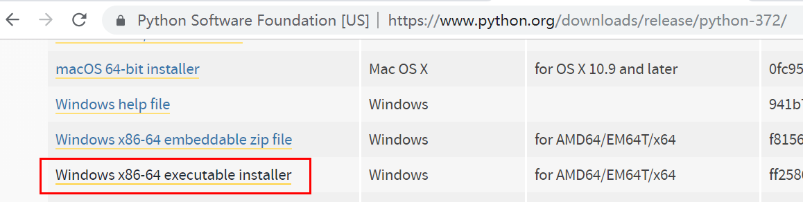
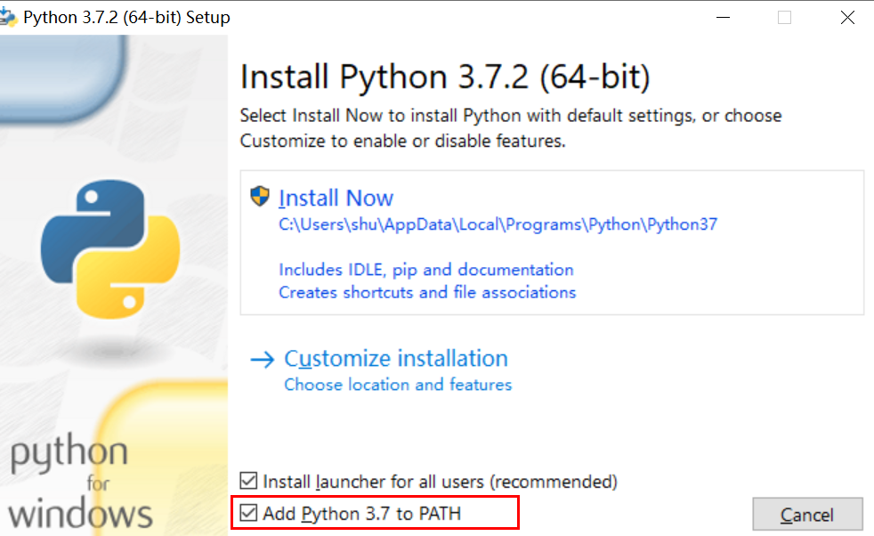
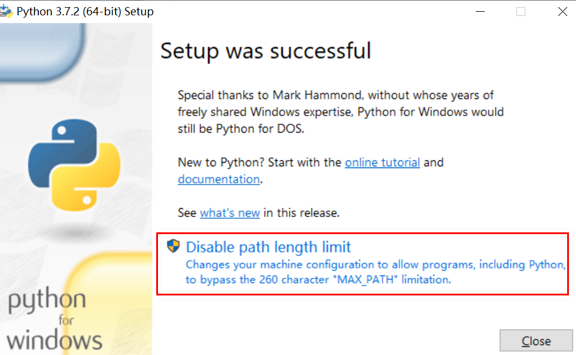
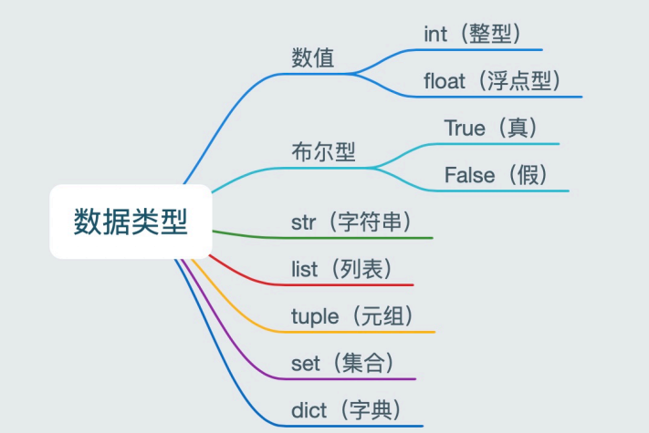

## day 01-安装

### 1 解释器

Python解释器器作⽤用：运⾏行行⽂文件   

 

### 2 下载

<https://www.python.org/downloads/release/python-372/> 




勾选添加环境变量



安装结束,要点击红框的东西




### 3 下载python插件

https://blog.csdn.net/qq_38188725/article/details/80623710

### 4 python注释

单行注释    

```python
# 单行注释
```

多行注释

```python
"""
第一行注释
第二行注释
第三行注释
"""
```

### 5 python变量

标志符号:
由数字、字母、下划线组成
不能数字开头 
不能使用内置关键字 
严格区分大小写  

```python
#定义变量
#语法：变量名 = 值
my_name = 'TOM'
print(my_name)
```

命名:

大驼峰：即每个单词首字母都大写，例如： MyName 。 

小驼峰：第二个（含）以后的单词首字母大写，例如： myName 。 

下划线：例如： my_name 。    


### 6  数据类型



检测数据类型的方法 type()    有点相当于java的 instanceof()

```python
intTest=1
print(intTest)
print(type(intTest))
stringTest="hello world"
print(stringTest)
print(type(stringTest))
c = True
print(type(c)) # <class 'bool'> -- 布尔型
e = [10, 20, 30]
print(type(e)) # <class 'list'> -- 列表
f = (10, 20, 30)
print(type(f)) # <class 'tuple'> -- 元组
h = {10, 20, 30}
print(type(h)) # <class 'set'> -- 集合
g = {'name': 'TOM', 'age': 20}
print(type(g)) # <class 'dict'> -- 字典
```

