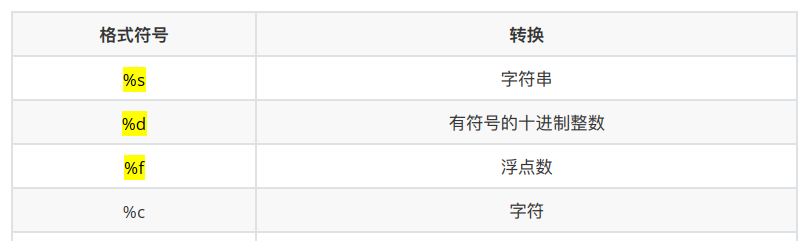

## day02 

### 1 输入

```pethon
"""
1. 书写input
    input('提示信息')
2. 观察特点
    2.1 遇到input，等待用户输入
    2.2 接收input存变量
    2.3 input接收到的数据类型都是字符串
"""

password = input('请输入您的密码：')
print(f'您输入的密码是{password}')

print(type(password))
```

### 2 输出

```
print()  #输出函数
```

####2.1 格式化输出

按照一定格式输出




```
# 1. 今年我的年龄是x岁 -- 整数 %d
print('今年我的年龄是%d岁' % age)
# 2. 我的名字是x -- 字符串 %s
print('我的名字是%s' % name)
# 3. 我的体重是x公斤 -- 浮点数 %f
print('我的体重是%.3f公斤' % weight)

```

Tip:

1. %06d，表示输出的整数显示位数，不足以0补全，超出当前位数则原样输出 

2. %.2f，表示小数点后显示的小数位数    

#### 2.2 转义字符

```
print('hello\nPython')  #换行
print('\tabcd')         #制表符,一个tab键(4个空格)的距离
```

#### 2.3 数据类型转换

1. int()        数据--> int
2. float()    float() -- 将数据转换成浮点型
3. str()       str() -- 将数据转换成字符串型
4. list()       list() -- 将一个序列转换成列表
5. tuple()   tuple() -- 将一个序列转换成元组
6. eval()     eval() -- 计算在字符串中的有效Python表达式,并返回一个对象

```
str2 = '1'
str3 = '1.1'
str4 = '(1000, 2000, 3000)'
str5 = '[1000, 2000, 3000]'
print(type(eval(str2)))    #<class 'int'>
print(type(eval(str3)))    #<class 'float'>
print(type(eval(str4)))    #<class 'tuple'>
print(type(eval(str5)))    #<class 'list'>
```


## #3 逻辑运算符

```
a = 0
b = 1
c = 2
# 1. and: 与: 都真才真
print((a < b) and (c > b))
print(a > b and c > b)
# 2. or：或 : 一真则真，都假才假
print(a < b or c > b)
print(a > b or c > b)
# 3. not： 非: 取反
print(not False)
print(not c > b)
```

### 4 复合运算符

```
# 注意： 先算复合赋值运算符右面的表达式； 算复合赋值运算
c = 10
c += 1 + 2
print(c)   # 13
```